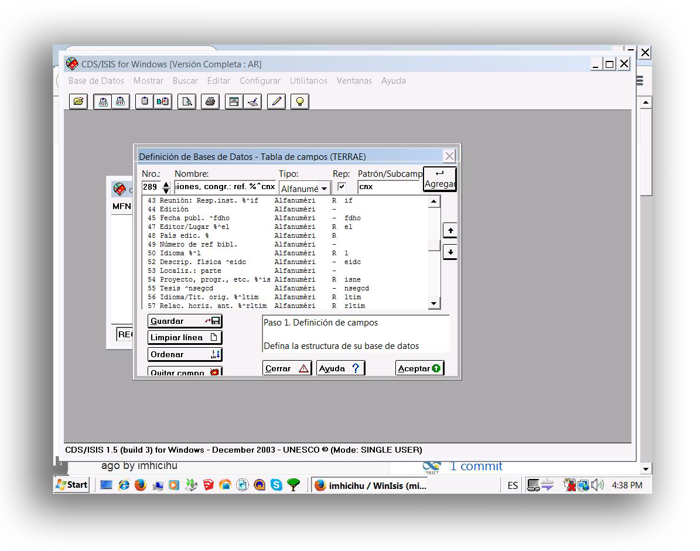
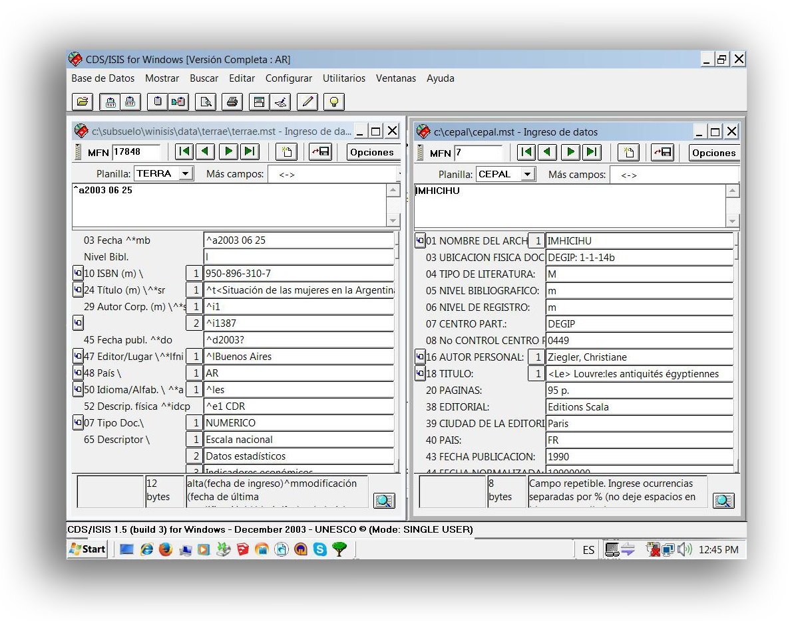
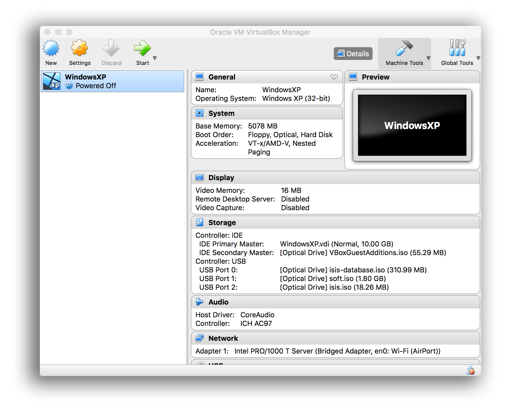

# Rationale #

* Procedures that describe the workflow/road of migrate 3 databases in 3 different operating systems (Windows 98, Windows XP, Windows Vista), in outdated file formats. 
* In the [Bibliography.md](Bibliography.md) there are some _insights_ about the original database created, maintained, curated in the [90's](https://bitbucket.org/imhicihu/terrae-database/src/master/README.md) or in the original Terrae, _vide_ this [issue](https://bitbucket.org/imhicihu/winisis-migration/issues/5/workflow-insights-internal-use)
* _Goal_: generate an unique database compatible with the most current file format specifications.

### What is this repository for? ###

* Quick summary
     - Workflow with a focus in the steps (mandatory) to migrate some [older database](https://bitbucket.org/imhicihu/terrae-database/src/master/README.md) (_circa_ 1990's) to current file format specifications. 
* Version 1.0

### How do I get set up? ###

* Summary of set-up
     - Check our [WinIsis operating system test](https://bitbucket.org/imhicihu/winisis-migration/issues/1/software-winisis-compatibility-test)
     - Windows 98 iso image file (_favorite_)
     - Windows Xp iso image file (_favorite_)
     - [Windows 7 iso](https://www.microsoft.com/en-us/software-download/windows7) image file
          + once installed Windows 7 ISO _via_ VirtualBox, install [Windows Virtual PC](https://www.microsoft.com/es-ar/download/details.aspx?id=3702) and then [Windows XP Mode for Windows 7](https://www.microsoft.com/es-ar/download/details.aspx?id=8002). This will create a virtual environment, mandatory in this case because compatibilities issues. WinIsis runs _natively_ on 32 bits, so all the operating systems must follow this requisite, at this point, *essential*. 
	 - [WinIsis](http://biblio1.mdp.edu.ar/index2.php?pagina=recursos/wisis/winisis.php)
     - [VirtualBox](https://www.virtualbox.org/) (software that create a custom virtual environment) plus [VirtualBox Extension Pack](https://www.virtualbox.org/wiki/Downloads)
     
     - [Docker](https://www.docker.com/) (to create custom environments)
     - [Google Spreadsheet](https://spreadsheets.google.com/)
     - [db3iso](ftp://library.tomsk.ru/pub/isis/isis_products/db-iso/ver2/db3iso.zip)
     - [Beautiful Soap](https://www.crummy.com/software/BeautifulSoup/#Download): unencoding of unicode text to UTF-8 format specification. A kind of swiss-army knife of encoding-unencoding text files. 
     - [SWK](ftp://irbis.tomsk.ru/pub/isis/isis_products/swk-isis-utilites/)

### Related repositories

* Some repos linked with this repository:
     - [Terra database](https://bitbucket.org/imhicihu/terrae-database/src/master/)
     - [Database on mobile device: Reinhardt Collection](https://bitbucket.org/imhicihu/database-on-mobile-device/src/master/)
     - [Bibliographical database (migration)](https://bitbucket.org/imhicihu/bibliographical-database-migration/src/master/)
     - [Databases (repositories)](https://bitbucket.org/imhicihu/databases-repositories/src/master/)
     - [Migration data (checklist)](https://bitbucket.org/imhicihu/migration-data-checklist/src/master/)
     - [IMHICIHU Digital repository](https://bitbucket.org/digital_repository/imhicihu-digital-repository/)

### Roadmap
* _Vide_ [To_do.md](To%20Do.md)

### Checklist
* Verify our internal [checklist](Checklist.md) and apply it according your needs

### Issues ###
* Check them on [here](https://bitbucket.org/imhicihu/winisis-migration/issues)

### Who do I talk to? ###
* Repo owner or admin
     - Contact `imhicihu` at `gmail` dot `com`

### Code of Conduct
* Please, check our [Code of Conduct](https://bitbucket.org/imhicihu/win-isis-migration/src/master/code_of_conduct.md)

### Legal ###
* Windows is a registered trademark of Microsoft Corporation in the United States and/or other countries.
* All trademarks are the property of their respective owners.

### License ###
* The content of this project itself is licensed under the  